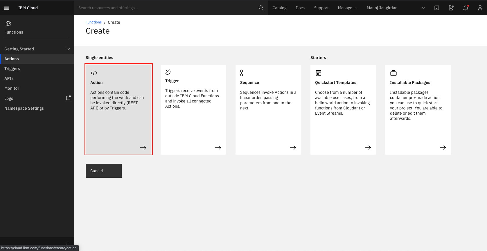

### !Documentation in progress
# Augment IBM Watson Services to WhatsApp

**Note: This is a Composite Code Pattern and it requires you to have completed the [Augment IBM Watson Services to WhatsApp](https://github.com/IBM/augment-watson-services-to-whatsapp) code pattern before proceeding.**

In this Code Pattern, we will build a WhatsApp bot augmented with IBM Watson services that will be capable of classifying food images provided by the users in WhatsApp.

When you have completed this code pattern, you will understand how to:

* Integrate IBM Watson Services to WhatsApp.
* Deploy Application to IBM Cloud Foundry.
* Write code snippets as serverless Cloud Functions.
* Expose APIs from serverless Cloud Actions.

<!--add an image in this path-->


<!--Optionally, add flow steps based on the architecture diagram-->
## Flow

1. User sends a message to WhatsApp.

2. The message is redirected to Twilio Programmable Messaging service.

3. Twilio Programmable Messaging service will further forward the message to the backend application hosted on IBM Cloud.

4. The backend application interacts with the Watson Visual Recognition service to get the response.

5. Watson Visual Recognition service does the necessary computation and returns a response accordingly.

6. The backend application processes the response and converts it to user readable format and forwards it Twilio.

7. Twilio forwards this message as a reply on WhatsApp.

8. The user will receive this as a response from Watson Visual Recognition service on WhatsApp.

<!--Optionally, update this section when the video is created-->
# Watch the Video

<!--[](https://www.youtube.com/watch?v=Jxi7U7VOMYg)-->

# Pre Requisites

1. [IBM Cloud Account](https://cloud.ibm.com/registration).
2. [IBM Cloud CLI](https://cloud.ibm.com/docs/cli?topic=cloud-cli-getting-started&locale=en-US).
3. [IBM Cloud Object Storage](https://cloud.ibm.com/catalog/services/cloud-object-storage).


# Steps

1. [Clone the repo](#1-clone-the-repo).
2. [Create Watson services](#2-create-watson-services).
    - [2.1. Watson Visual Recognition](#22-watson-visual-recognition).
3. [Create serverless cloud functions](#3-create-serverless-cloud-functions).
4. [Deploy the Server Application on IBM Cloud Foundry, Create Twilio service & Configure credentials **_(Completed in previous code pattern)_**](#4-deploy-the-server-application-on-ibm-cloud-foundry-create-twilio-service-&-configure-credentials).


### 1. Clone the repo

Clone the `augment-watson-services-to-whatsapp-2` repo locally. In a terminal, run:

```bash
git clone https://github.com/IBM/augment-watson-services-to-whatsapp-2
```

We’ll be using the file [`food-visual-recognition.py`](food-visual-recognition.py)

### 2. Create Watson services

Create the following services:

#### 2.1. Watson Visual Recognition

- Login to IBM Cloud, and create a [**Watson Visual Recognition**](https://cloud.ibm.com/catalog/services/visual-recognition) service, make a note of the **region** that you select and click on **create** as shown.


- Once the service is created, click on the **service credentials** tab on the left panel and click on **New credential**, copy the service credentials by clicking the copy button as shown.


- At this point, you should have the Watson Visual Recognition credentials copied in any notepad as these will be used in [Step 5](#5-configure-credentials).

### 3. Create serverless cloud functions

IBM Cloud Function is a Serverless Architecture where in a user can write a snippet of code and run it as API's without worrying about deploying it. A code snippet can easily be attached to an already existing deployment to add more Functionality.

- Goto [IBM Cloud Resources](https://cloud.ibm.com/resources), and click on the **hamburger menu** and select **Functions > Actions** as shown. 


- In Cloud Actions page, click on **Create** to get started.


- A **Single entities** list with Actions, Triger, Sequence, Quickstart Templates and Installable Packages will be presented. Select the **Action** to proceed.



- Enter a `name` for the action, you can either create a custom package or leave it as `default package` and lastly select the `Runtime` as `Python 3.7` and click on **Create**.


- An IDE with Hello World code written in python will be presented, replace everything from the IDE with the code present in the file [`food-visual-recognition.py`](food-visual-recognition.py).


- After adding the code, click on the **Save** button to save the cloud function.


- Once the Cloud Function is code ready, you need to expose an API so that the Backend server can interact with the written code. Click on **Endpoints** and **Enable as Web Action** and finally click on **Save** button as shown.


- After you have enabled as **Web Action** you will see a `URL`, copy the `URL` as it will be used in the next step.


- At this point, you have successfully setup a serverless cloud function to classify food images.

### 4. Deploy the Server Application on IBM Cloud Foundry, Create Twilio service & Configure credentials

- Refer the [Augment IBM Watson Services to WhatsApp](https://github.com/IBM/augment-watson-services-to-whatsapp) code pattern to **deploy the backend server application**, **create Twilio service** and **configure the Twilio credentials**.

- On completing the above step, you will have to configure the Watson Visual Recognition credentials generated in [Step 2](#2-create-watson-services) additionally.

- Under **Add Watson services to the Application**, select the **Watson Visual Recognition** radio button and click on **Add Watson Credentials** button, here add service credential that was generated in [Step 2](#2-create-watson-services) and the `cloud functions url` generated in [Step 3](#2-create-watson-services), finally click on **Submit**. You will now see `Watson Visual Recognition` under **Configured Services**.


- At this point, you have successfully configured the backend for WhatsApp to communicate with Watson services through Twilio messaging service as Inter-mediator.

- At this point, all the setup is completed and now its time to explore what you just built!

# Sample output

- Once the model is deployed and ready to use, the **View Application in Action** panel will be visible in the Application.


- Scan the QR code in your Phone to open the WhatsApp chat with Twilio.

- A WhatsApp chat will open up in your phone with a typed code `join <sandbox name>`.

- Replace the `<sandbox name>` with your `Sandbox Name` obtained from [Step 4](#4-create-twilio-service) and send the message.

>NOTE: If you are unable to scan the QR code, save the phone number **+14155238886**, open WhatsApp and send a message to the saved number with code `join <sandbox name>`.

The workflow of the app is as follows:

NOTE: The user has to follow the exact same workflow for the WhatsApp to reply as intended.

## Flow 1: Where user gives the Locality manually.

User|Reply|Screenshot
---|---|---
Hi | The message, 'Hi' that you typed on your phone, went through Whatsapp -> Twilio -> Python App hosted on IBM Cloud and returned back to you from Python App hosted on IBM Cloud -> Twilio -> Whatsapp. How Cool is that!! Try asking <b>What can you do?</b> | 
What can you do? | I am a bot who is connected to watson services on IBM Cloud! Try asking <b>What are the services you are connected to?</b> | 
What are the services you are connected to? | I found the following services associated to me: 1. Watson Machine Learning -> *ready* Enter the number to know more. | 
2 | Send any food image from your Camera or Gallery to classify the food with Watson Visual Recognition | 
\<image of pasta\> | Classified as pasta salad with an accuracy of 71.1% | 
\<image of an ice cream\> | Classified as sundae with an accuracy of 87.0% | 
\<image of nachos\> | Classified as nachos with an accuracy of 79.81% | 


At the end of the code pattern you will have learnt how to Augment multiple IBM Watson services to WhatsApp.

## License

This code pattern is licensed under the Apache License, Version 2. Separate third-party code objects invoked within this code pattern are licensed by their respective providers pursuant to their own separate licenses. Contributions are subject to the [Developer Certificate of Origin, Version 1.1](https://developercertificate.org/) and the [Apache License, Version 2](https://www.apache.org/licenses/LICENSE-2.0.txt).

[Apache License FAQ](https://www.apache.org/foundation/license-faq.html#WhatDoesItMEAN)
